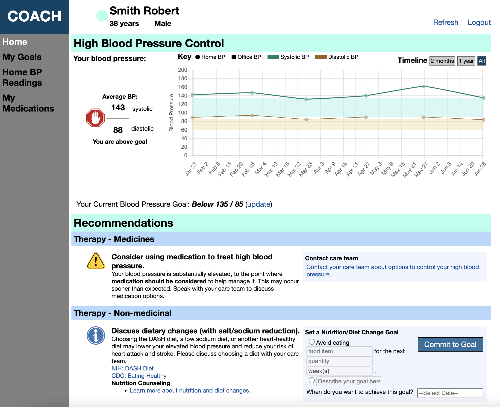

# COACH (Collaboration Oriented Approach to Controlling High Blood Pressure)

COACH is a patient-facing clinical decision support tool for managing high blood pressure. It integrates with Electronic Health Records using FHIR and with [CQF Ruler](https://github.com/DBCG/cqf-ruler) for executing decision support plan definitions. The plan definitions and recommendation logic are stored in this [implementation guide](https://github.com/OHSUCMP/htnu18ig). COACH also uses a MySQL database for application storage.

The COACH home page displays recent blood pressures and a set of recommendations based on the patient's health record. The patient may enter new blood pressure readings, set goals, and review medications.



# Docker

The COACH application is packaged as a Docker image, and the latest is available here:

```docker pull ghcr.io/ohsucmp/coach:latest```

In order to run COACH, connections to the database, the EHR FHIR server, and CQF Ruler must be configured. In addition, an [API key](https://www.nlm.nih.gov/vsac/support/usingvsac/vsacsvsapiv2.html) for the Value Set Authority Center is required.

If you already have these pieces in place and they are externally addressable, then configure a properties file to provide COACH the information needed. Make a local copy of [application.properties](src/main/resources/application.properties), override any configuration needed, and mount the file into the Docker container when running:

```docker run -p 8082:8082 -v $(pwd)/override.properties:/opt/app/application.properties ghcr.io/ohsucmp/coach```

If you want to run everything locally, both the database and CQF Ruler can also be set up as containers. Docker-compose files are provided to facilitate this. To use these, clone this repository. Copy the file "env.sample" to ".env" and fill out the API key in this file.

## Running the MySQL database as a container

Using the docker-compose file provided, you can run the MySQL database as a container.

```docker-compose up mysql```

The schema will be created using the file [db-schema.sql](db-schema.sql) the first time the conainer runs. It will persist on restart.

## Running CQF Ruler as a container

Run the CQF Ruler service in the docker-compose setup:

```docker-compose up cqfruler```

Once this is running, you have to populate it with the plan definitions COACH needs to provide recommendations. Like the mysql service, you only have to do this the first time you run - the resources will persist on restart. To populate CQF Ruler, grab the latest release of the [implementation guide](https://github.com/OHSUCMP/htnu18ig/releases/tag/v1.0.0), unzip, and run the Python script at specification/PopulateCQFRuler2.py

## Running COACH with docker-compose

The docker-compose setup creates connections between the three Dockerized containers so they can communicate with each other. Without any other configuration changes, COACH can now be started and will automatically connect to a Logica Sandbox as its source EHR.

```docker-compose up app```


